# GitHub Actions CI/CD with AWS Elastic Beanstalk Deployment

Author: Oluwaseun Osunsola  
LinkedIn: https://www.linkedin.com/in/oluwaseun-osunsola-95539b175/  
Project GitHub Link: https://github.com/Oluwaseunoa/github-actions-demo  

This project demonstrates a complete **CI/CD pipeline** for a Node.js application using **GitHub Actions**, **semantic releases**, and **AWS Elastic Beanstalk** for deployment. It includes **99 screenshots** documenting each step of the process.


## Table of Contents

1. [Project Overview](#project-overview)
2. [Prerequisites](#prerequisites)
3. [Project Setup](#project-setup)
4. [Local Testing](#local-testing)
5. [CI Pipeline Setup](#ci-pipeline-setup)
6. [Semantic Release Pipeline](#semantic-release-pipeline)
7. [AWS Setup and Elastic Beanstalk Deployment](#aws-setup-and-elastic-beanstalk-deployment)
8. [Deploy Workflow](#deploy-workflow)
9. [Release and Deployment Verification](#release-and-deployment-verification)
10. [Project Implementation](#project-implementation)

---

## Project Overview

This project sets up a Node.js application with:

* **Express.js server**
* **Mocha** for testing
* **GitHub Actions CI pipeline** for continuous integration
* **Semantic release** for automated versioning
* **Elastic Beanstalk deployment workflow** triggered by releases

---

## Prerequisites

* Node.js v20 installed locally
* GitHub repository created
* AWS account with **Elastic Beanstalk** access
* IAM user with **AdministratorAccess**
* GitHub repository secrets for AWS credentials:

  * `AWS_ACCESS_KEY_ID`
  * `AWS_SECRET_ACCESS_KEY`
  * `AWS_REGION`

---

## Project Setup

1. **Create repository** and initialize with README
2. **Clone the repository** locally
3. **Initialize Node.js project** with `npm init -y`
4. **Install Express**: `npm install express`
5. **Create `app.js`** and add basic server code
6. **Install Mocha for testing**: `npm install --save-dev mocha`

---

## Local Testing

* Write simple test in `test.js`
* Update `package.json` scripts for testing
* Run `npm test` locally to verify functionality
* Start the server locally: `npm start`
* Visit `http://localhost:3000` to verify “Hello, World! This is version 1.0.0”

---

## CI Pipeline Setup

* Create `.github/workflows/ci.yml`
* Steps include:

  * Checkout code
  * Install dependencies
  * Run tests
* Push to GitHub triggers **CI workflow**
* Verify workflow runs successfully

---

## Semantic Release Pipeline

* Install dependencies for **semantic-release**
* Configure `.releaserc.json`
* Add `release.yml` workflow in GitHub Actions
* Commit conventional commits to trigger **automated releases**
* Releases tab shows auto-generated release notes

---

## AWS Setup and Elastic Beanstalk Deployment

* Log into AWS console
* Create IAM user and generate access keys
* Add repository secrets for AWS credentials
* Create Elastic Beanstalk application and environment:

  * Node.js platform
  * Single-instance environment
  * Default VPC and public IP
  * EC2 instance profile and service role
* Configure optional settings for monitoring, rolling updates, logging, and platform options

---

## Deploy Workflow

* Create `deploy.yml` workflow triggered by **release event**
* Workflow steps:

  * Checkout code
  * Install dependencies
  * Run tests
  * Zip application
  * Configure AWS credentials
  * Deploy to Elastic Beanstalk using `einaregilsson/beanstalk-deploy`

---

## Release and Deployment Verification

* Create release on GitHub (`v1.3.0`)
* Trigger deployment workflow
* Deployment pipeline runs successfully
* Visit Elastic Beanstalk URL to confirm application is live

---

## Project Implementation
---
## Step 1: Create a GitHub Repository

Create a new repository named `github-actions-demo` and initialize it with a README.

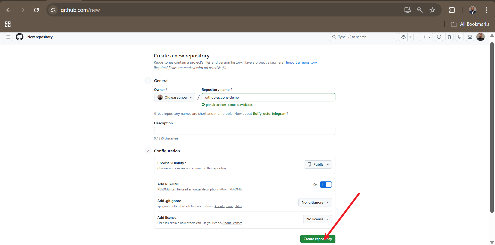

---

## Step 2: Copy Repository HTTPS URL

Copy the repository HTTPS URL to clone it locally.

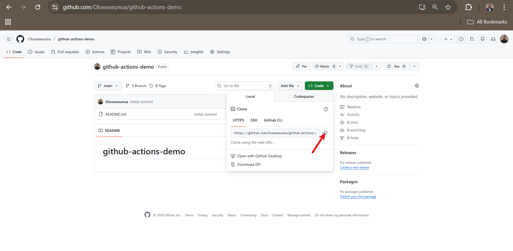

---

## Step 3: Clone Repository Locally

Clone the repository using the copied link and navigate into it:

```bash
git clone <repo-https-url>
cd github-actions-demo
```

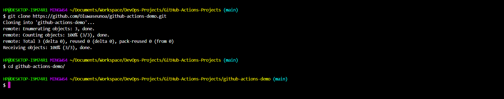

---

## Step 4: Verify Repository Contents

List files to verify that `README.md` exists:

```bash
ls
```

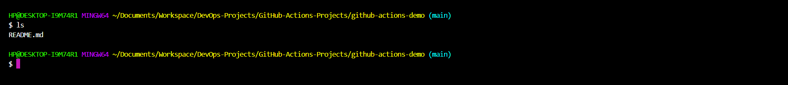

---

## Step 5: Initialize NPM

Initialize the project as a Node.js project:

```bash
npm init -y
```

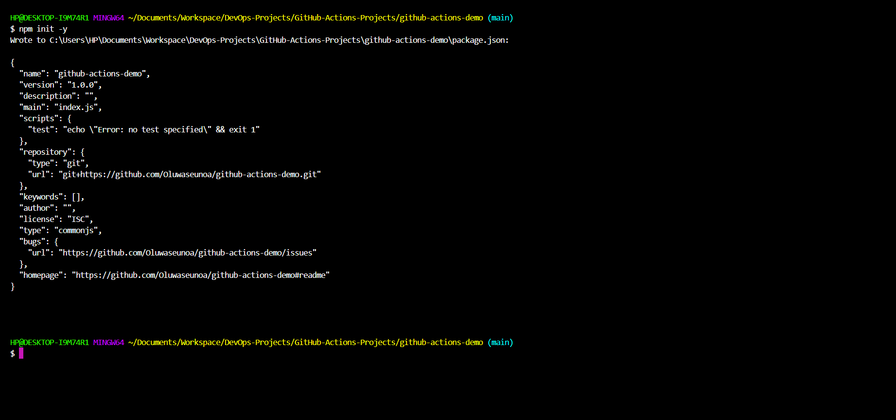

---

## Step 6: Verify `package.json`

Check that `package.json` now exists in the project folder:

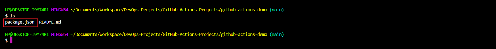

---

## Step 7: Install Express

Install Express framework as a dependency:

```bash
npm install express
```

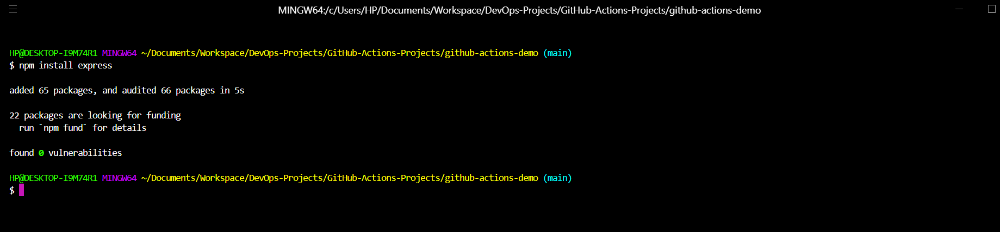

---

## Step 8: Create `app.js` and Open in VS Code

Create the main application file `app.js` and open the project in VS Code:

```bash
touch app.js
code .
```

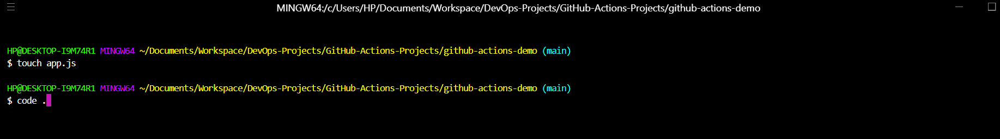

---

## Step 9: Add Code to `app.js`

Write the initial Node.js server code in `app.js`:

```javascript
const express = require('express');
const app = express();
const port = 3000;

app.get('/', (req, res) => res.send('Hello World!'));

app.listen(port, () => console.log(`Server running on port ${port}`));
```

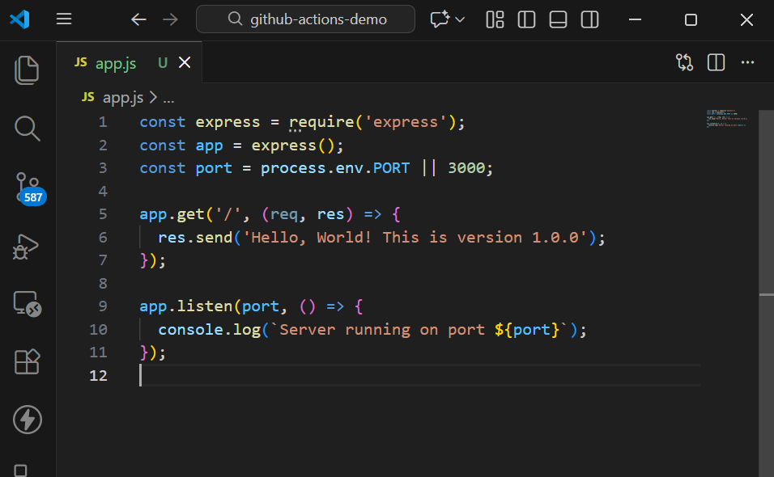

---

## Step 10: Install Mocha as Dev Dependency

Install Mocha for testing as a development dependency:

```bash
npm install --save-dev mocha
```

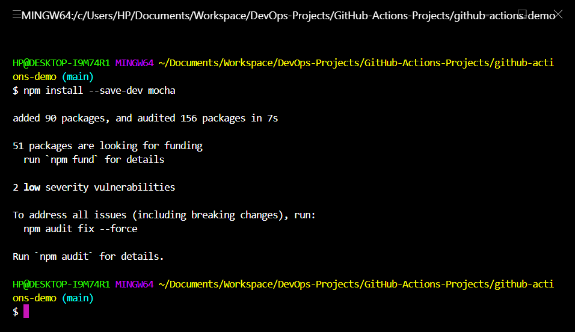

---

## Step 11: Create Test File

Create a test file named `test.js` inside the project:

```bash
touch test.js
```

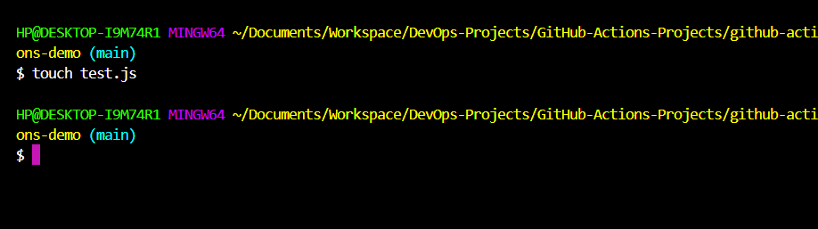

---

## Step 12: Write a Simple Test

Add a simple test in `test.js` to verify basic functionality:

```javascript
const assert = require('assert');

describe('Basic Test', () => {
  it('should return true', () => {
    assert.strictEqual(true, true);
  });
});
```


---

## Step 13: Modify Scripts in `package.json`

Update the `scripts` section in `package.json` to include test and start commands:

```json
"scripts": {
  "test": "mocha",
  "start": "node app.js"
}
```

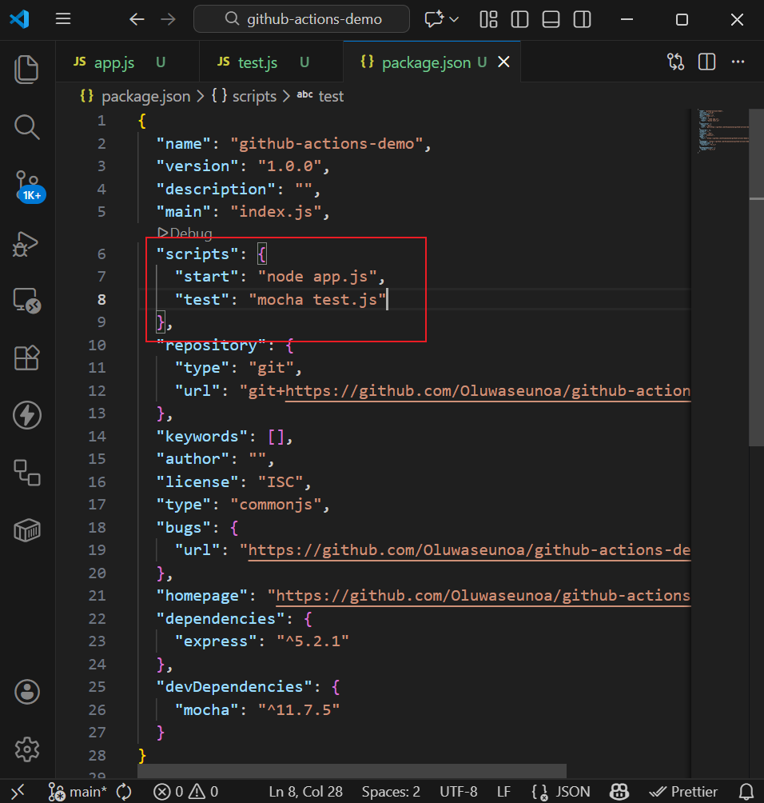

---

## Step 14: Run Tests Locally

Run tests to ensure they pass:

```bash
npm test
```

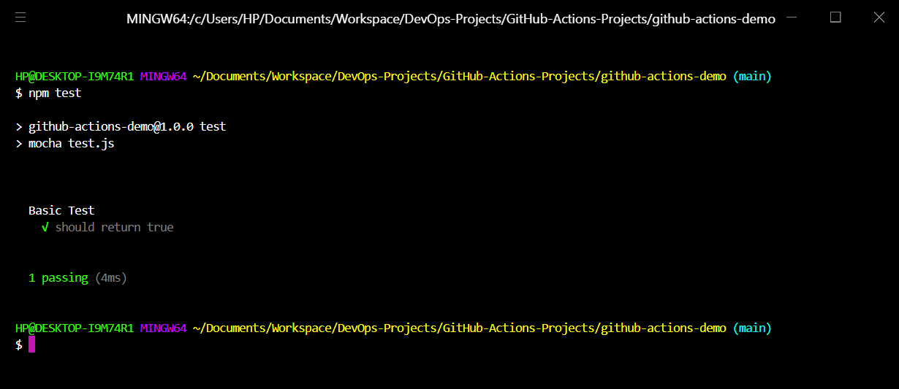

---

## Step 15: Run Application Locally

Start the application to test it in a local environment:

```bash
npm run start
```

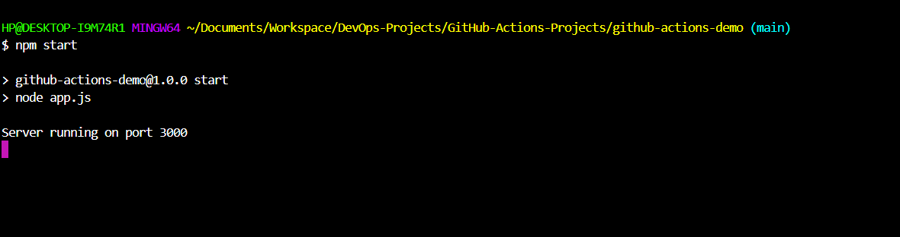

---

## Step 16: Verify Application in Browser

Visit `http://localhost:3000` to check the running application. It should display:

```
Hello, World! This is version 1.0.0
```


---

## Step 17: Stop the Server

Press `Ctrl + C` in the terminal to stop the running server:

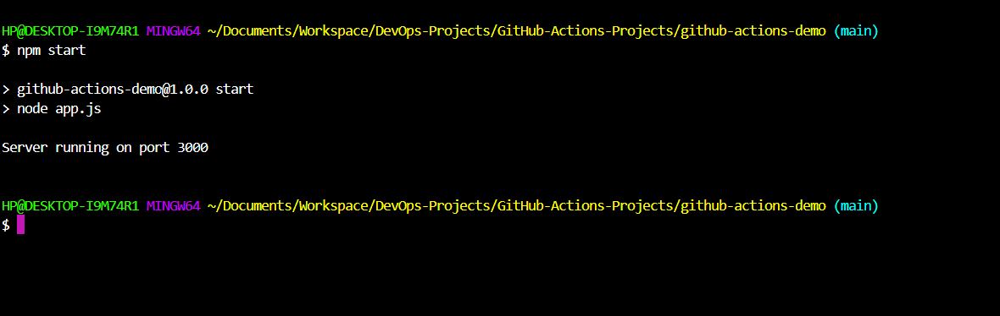

---

## Step 18: Create `.gitignore` File

Create a `.gitignore` file to exclude unnecessary files from Git:

```bash
touch .gitignore
```

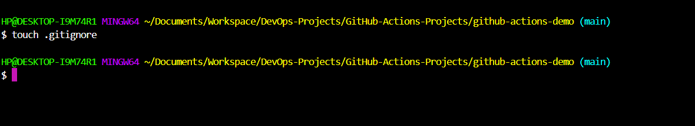

---

## Step 19: Add `node_modules` to `.gitignore`

Prevent committing `node_modules` by adding it to `.gitignore`:

```
node_modules/
```

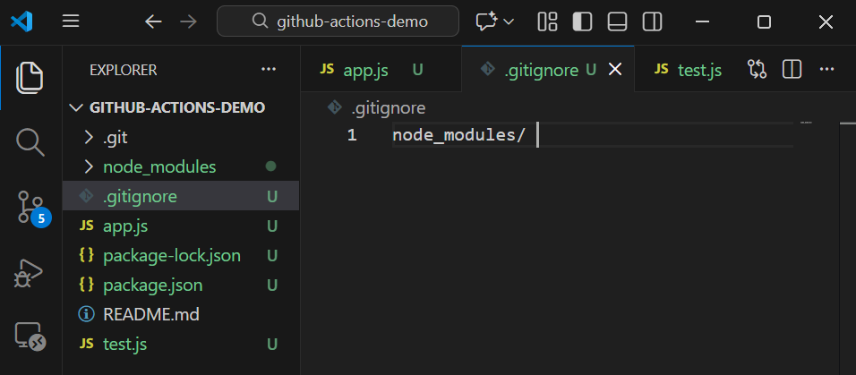

---

## Step 20: Commit and Push Changes

Commit all changes and push to the remote repository:

```bash
git add .
git commit -m "setup initial project structure, tests, and server"
git push origin main
```

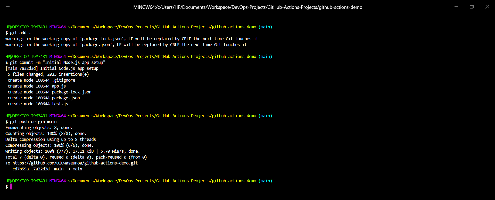

Perfect! Let’s continue the README with **steps 21–30**. I’ll maintain the same professional format and include all screenshots.

---

## Step 21: Verify Commit on GitHub

Check that your recent commit is now reflected on GitHub:

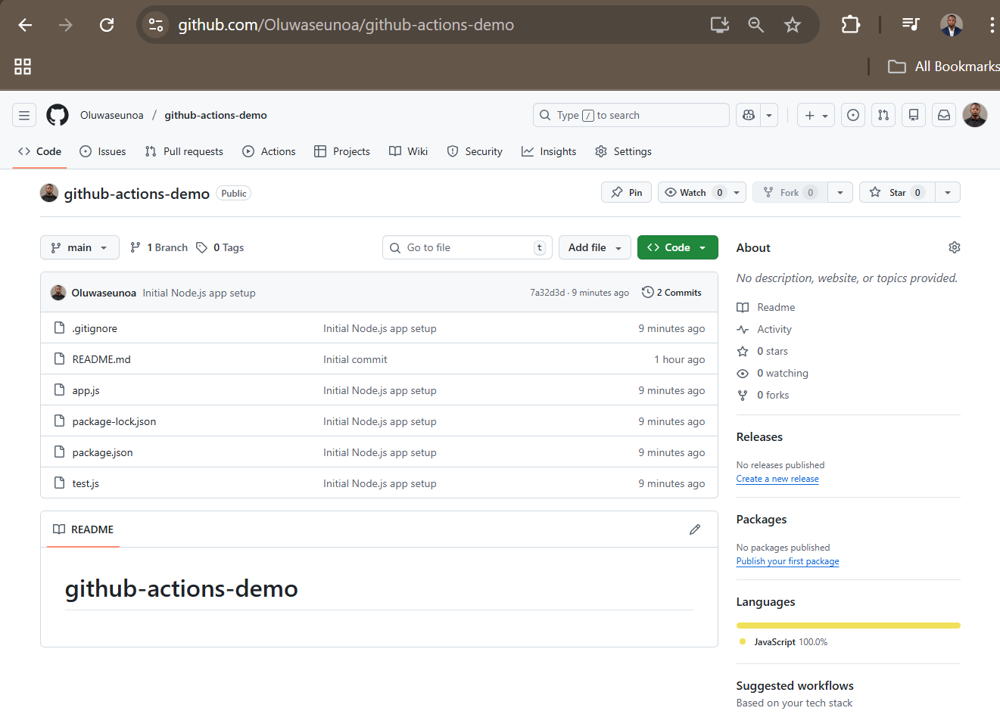

---

## Step 22: Create Workflow Directory

Create a `.github/workflows` directory in your project to store GitHub Actions workflows:

```bash
mkdir -p .github/workflows
```

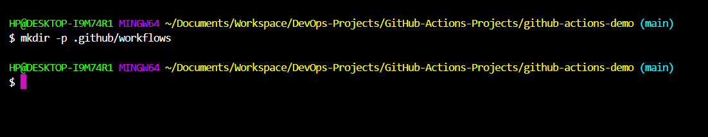

---

## Step 23: Create `ci.yml` Workflow File

Inside the workflows directory, create a `ci.yml` file for CI configuration:

```bash
touch .github/workflows/ci.yml
```

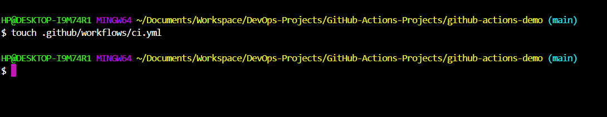

---

## Step 24: Add Pipeline Script to `ci.yml`

Edit `ci.yml` to include the pipeline configuration, e.g., for testing Node.js application:

```yaml
name: Node.js CI
on:
  push:
    branches: [ main ]
jobs:
  build:
    runs-on: ubuntu-latest
    steps:
      - uses: actions/checkout@v4
      - uses: actions/setup-node@v4
        with:
          node-version: '20'
      - run: npm install
      - run: npm test
```

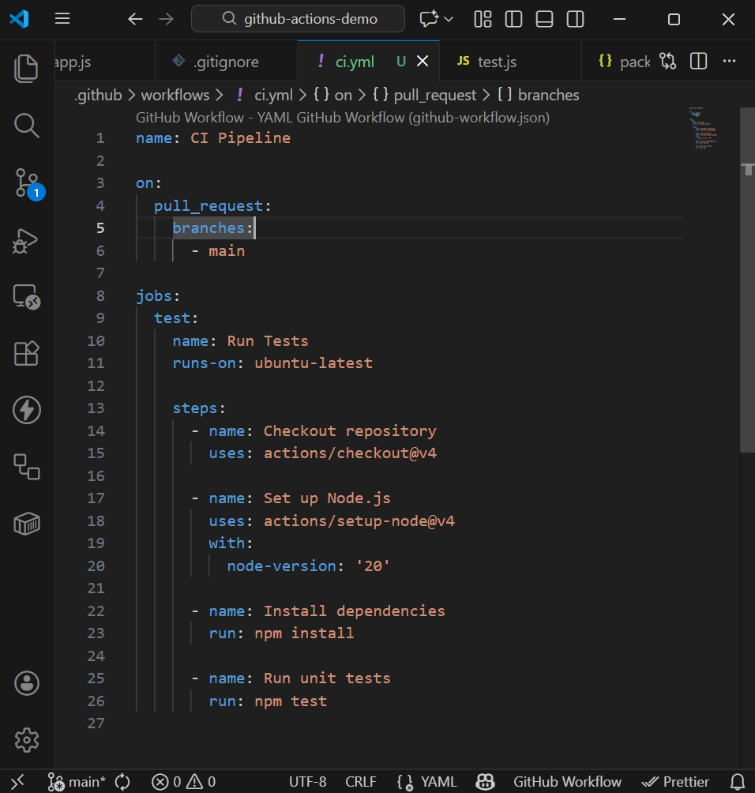

---
## Step 24b: Commit and Push Workflow File

Add, commit, and push the newly created workflow file to the repository:

```bash
git add .github/workflows/ci.yml
git commit -m "add CI workflow file"
git push origin main
```

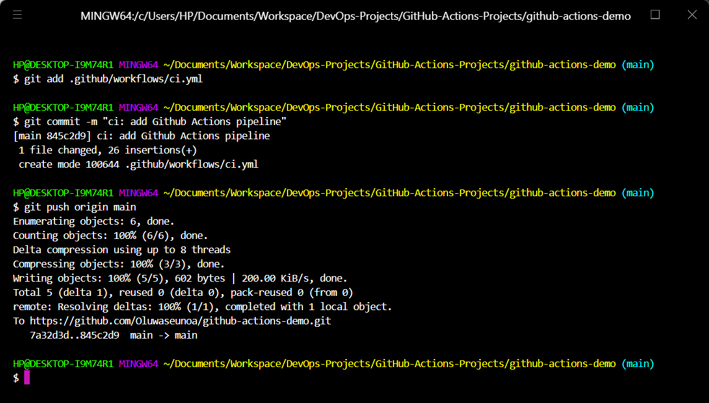

---

## Step 25: Create a Feature Branch

Create a new feature branch for updates:

```bash
git checkout -b feature/ci-test
```

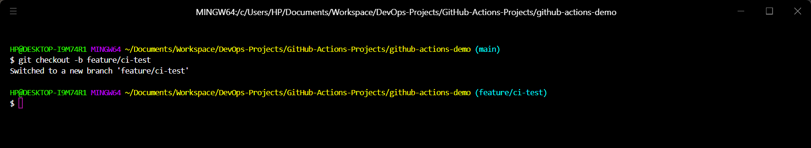

---

## Step 26: Edit `app.js` and Send to Hello, World! CI Pipeline Active

Make edits in `app.js` and ensure that the CI pipeline is active and triggered:

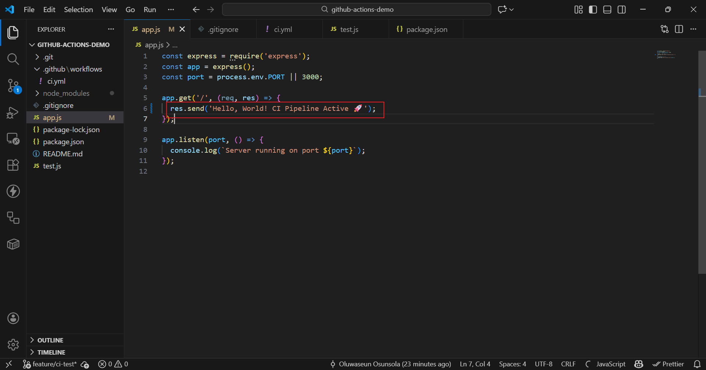

---

## Step 27: Commit and Push Feature Branch

Commit changes to the feature branch and push to GitHub:

```bash
git add .
git commit -m "update app.js for CI test"
git push origin feature/ci-test
```

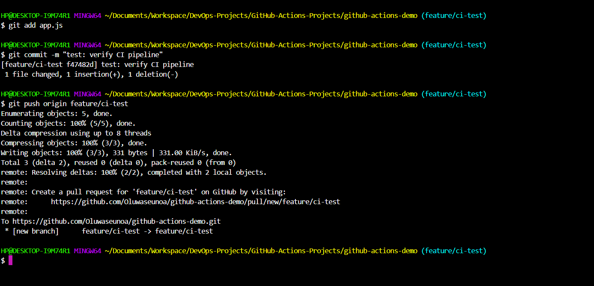

---

## Step 28: Open Pull Request on GitHub

Go to GitHub, compare your feature branch to `main`, and ensure your changes are ready for a Pull Request:

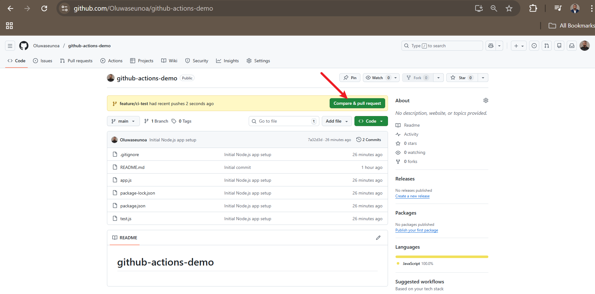

---

## Step 29: Create Pull Request

Scroll down on GitHub and click **Create Pull Request** to merge the feature branch:

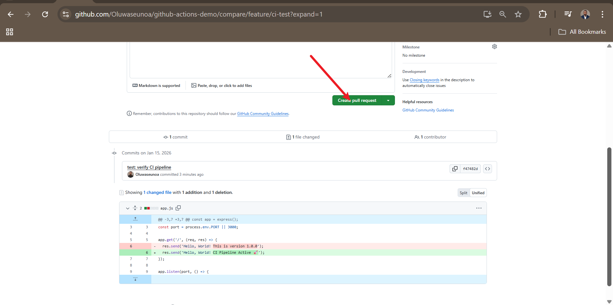

---

## Step 30: CI Pipeline Triggered

Once the Pull Request is created, the CI pipeline is automatically triggered and should pass:

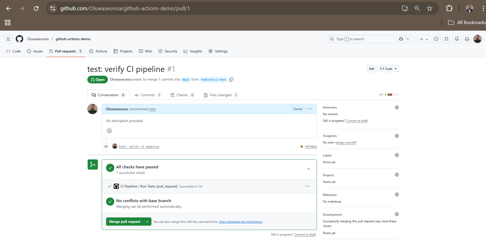

---

Great! Let’s continue the README with **steps 31–40**, keeping it clean, professional, and consistent with the previous sections.

---

## Step 31: Merge Pull Request

Click **Merge Pull Request** on GitHub to merge your feature branch into `main`.

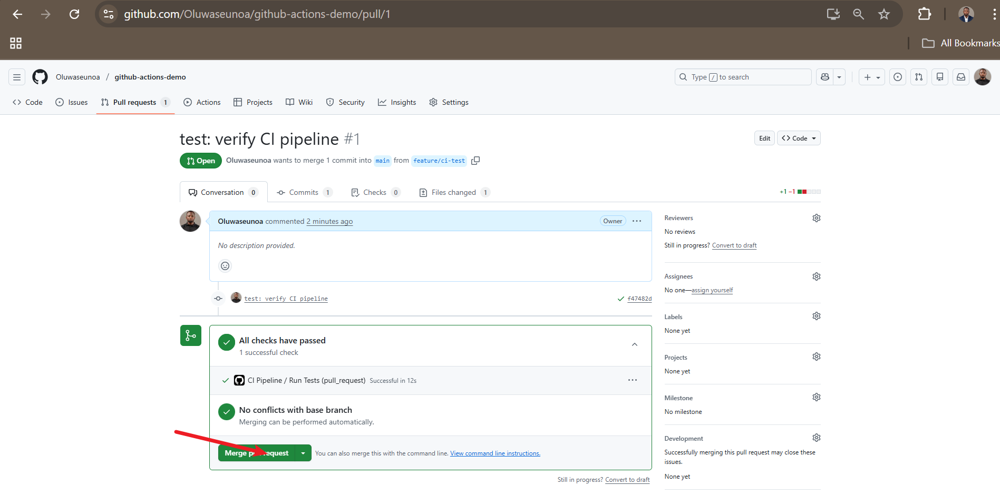

---

## Step 32: Confirm Merge

Confirm the merge to complete integrating the feature branch:

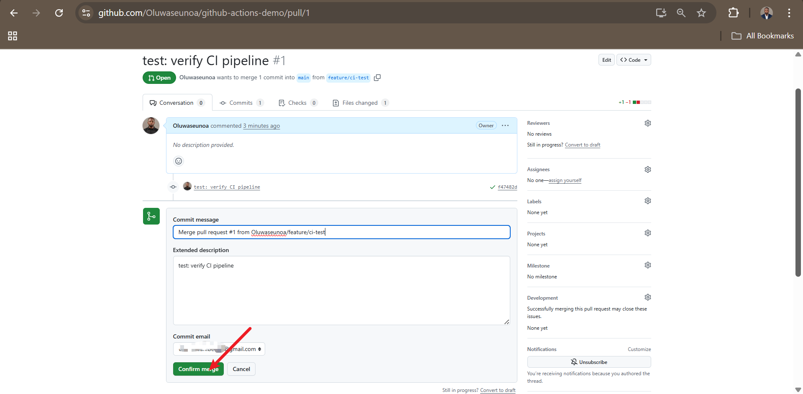

---

## Step 33: Update Local Main Branch

Checkout to the `main` branch locally and pull the latest changes from GitHub:

```bash
git checkout main
git pull origin main
```

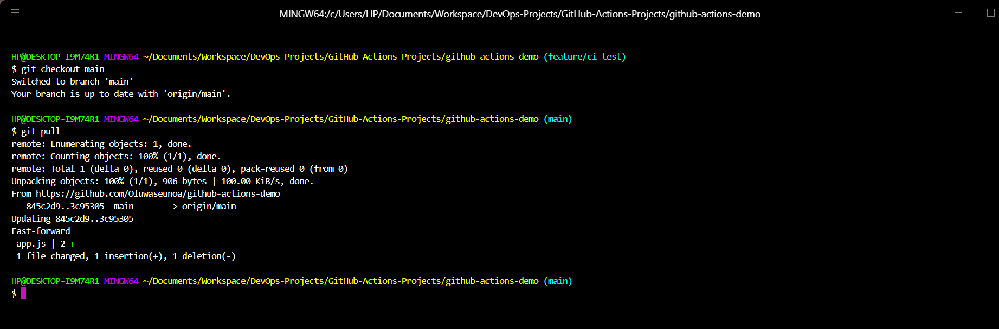

---

## Step 34: Install Semantic Release Dependencies

Install dependencies needed for automated semantic releases:

```bash
npm install --save-dev semantic-release @semantic-release/npm @semantic-release/github @semantic-release/commit-analyzer @semantic-release/release-notes-generator
```

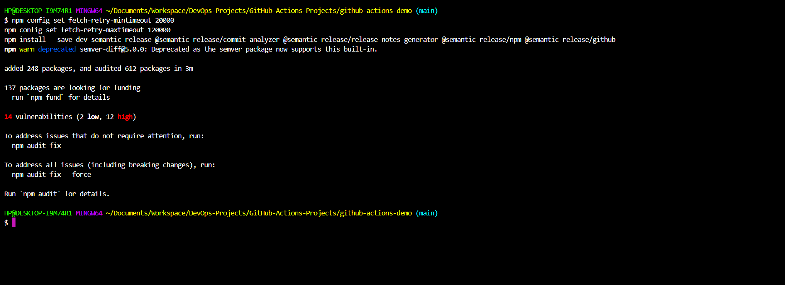

---

## Step 35: Create `.releaserc.json`

Create a `.releaserc.json` file in the root directory to configure semantic release:

```bash
touch .releaserc.json
```

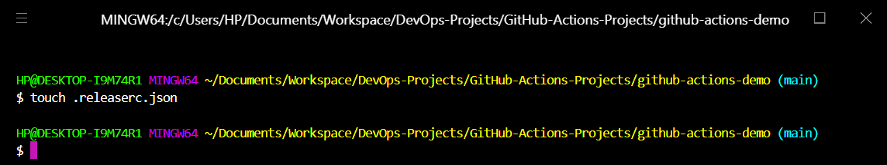

---

## Step 36: Add Code to `.releaserc.json`

Add the following configuration to `.releaserc.json`:

```json
{
  "branches": ["main"],
  "plugins": [
    "@semantic-release/commit-analyzer",
    "@semantic-release/release-notes-generator",
    "@semantic-release/npm",
    "@semantic-release/github"
  ]
}
```

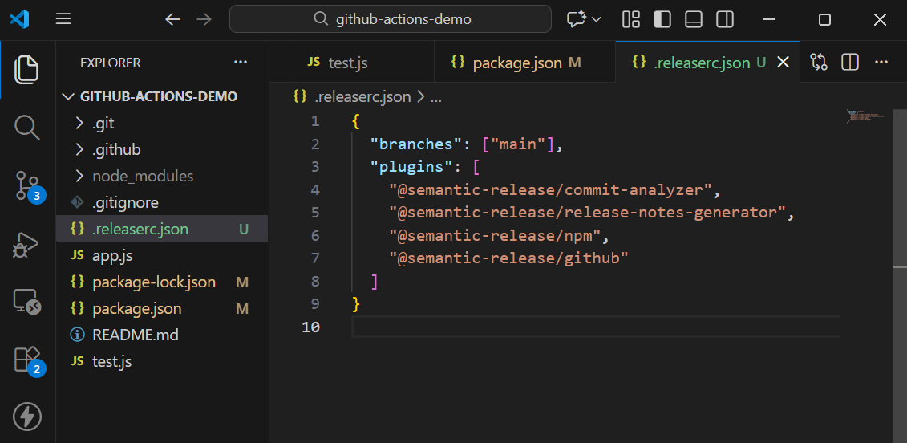

---

## Step 37: Prevent Publishing to NPM

Add `"private": true` to `package.json` to prevent accidental publishing to NPM:

```json
"private": true
```

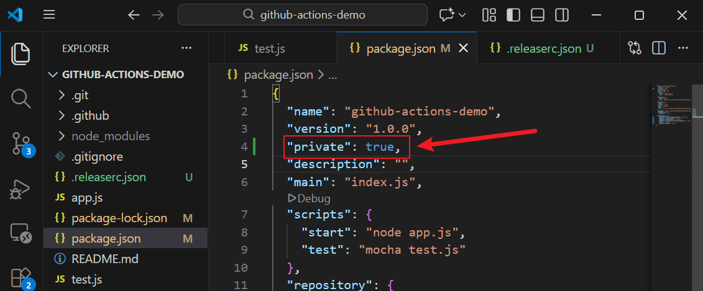

---

## Step 38: Create `release.yml` Workflow

Create a new GitHub Actions workflow file `release.yml` in `.github/workflows`:

```bash
touch .github/workflows/release.yml
```

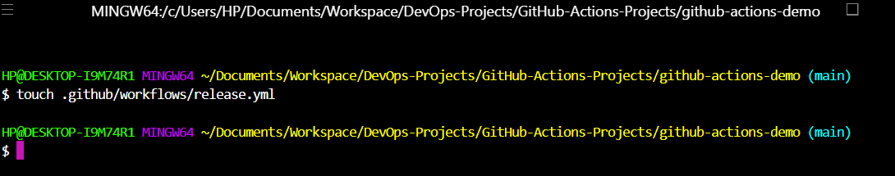

---

## Step 39: Add Release Pipeline Script

Edit `release.yml` to include the semantic release deployment pipeline:

```yaml
name: Release Pipeline
on:
  push:
    branches:
      - main
jobs:
  release:
    runs-on: ubuntu-latest
    steps:
      - uses: actions/checkout@v4
      - uses: actions/setup-node@v4
        with:
          node-version: '20'
      - run: npm ci
      - run: npx semantic-release
        env:
          GITHUB_TOKEN: ${{ secrets.GITHUB_TOKEN }}
          NPM_TOKEN: ${{ secrets.NPM_TOKEN }}
```

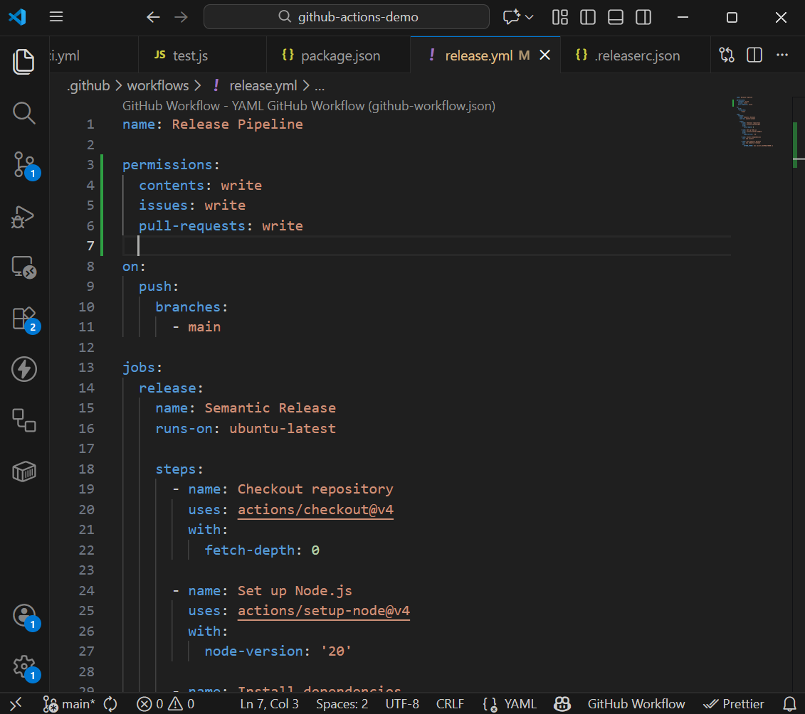

---

## Step 39b: Configure GitHub Actions Permissions

Go to **Repository → Settings → Actions → General** and enable **Read & Write** permissions for workflows, and allow GitHub Actions to create and approve Pull Requests. Then save the settings.

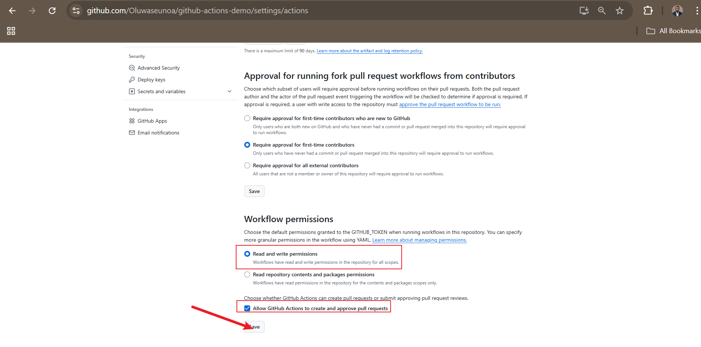

---

## Step 40: Commit Conventional Commit and Push

Commit all changes using a conventional commit message and push to GitHub:

```bash
git add .
git commit -m "chore: configure semantic release"
git push origin main
```

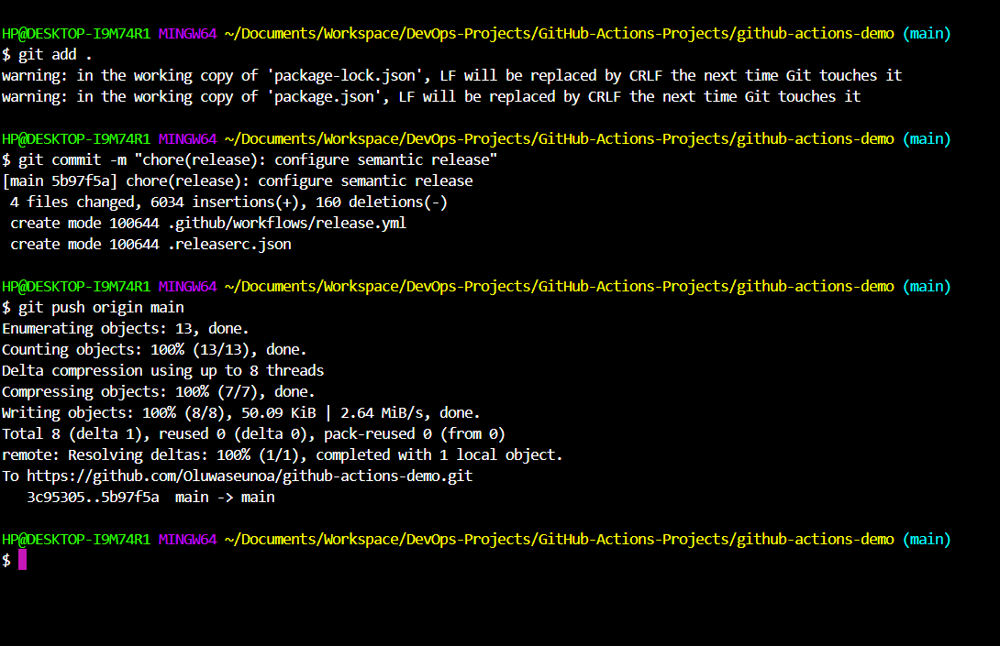

---

Perfect! Let’s continue the README with **steps 41–50**, keeping the professional style and linking each screenshot.

---

## Step 41: Edit `app.js` to Trigger Pipeline

Make the necessary edits in `app.js` that will trigger the release pipeline upon commit:

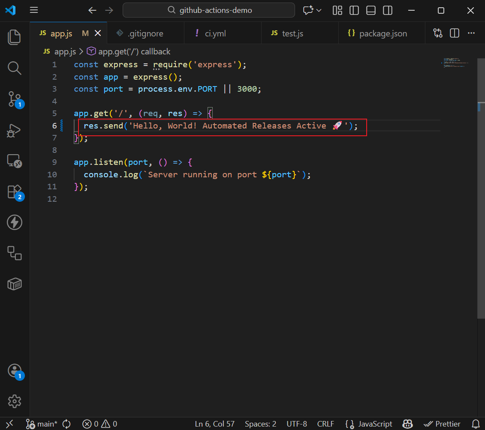

---

## Step 42: Commit and Push Changes

Commit your edits and push them to GitHub:

```bash
git add .
git commit -m "fix: trigger pipeline for testing release"
git push origin main
```

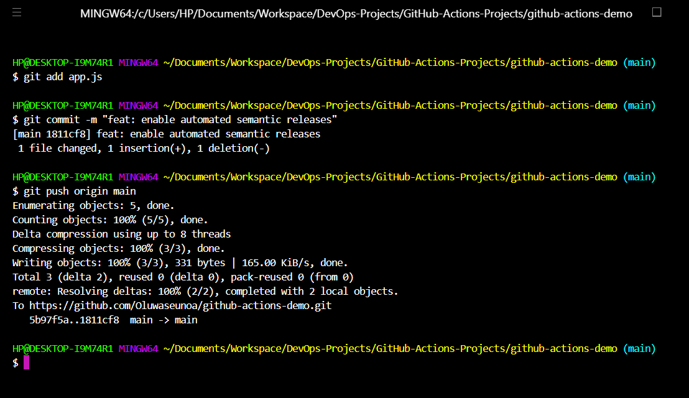

---

## Step 43: Verify Workflow Run

Go to the **Actions** tab in GitHub to ensure the workflow run completed successfully with no errors:

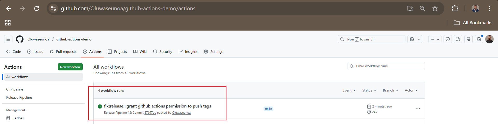

---

## Step 44: Access Release Pipeline

Click on the **Release Pipeline** to view the detailed run:

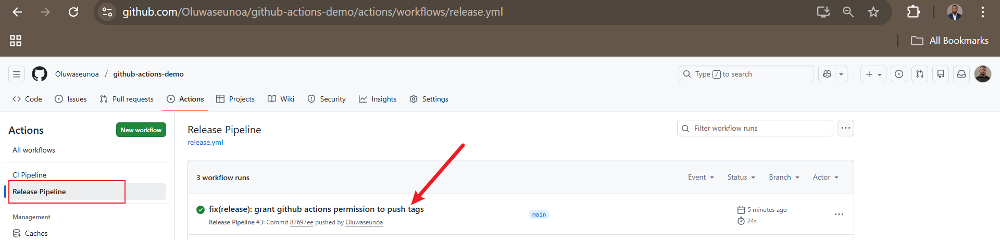

---

## Step 45: Release Pipeline Completed

Check that the release pipeline has run completely and all steps succeeded:

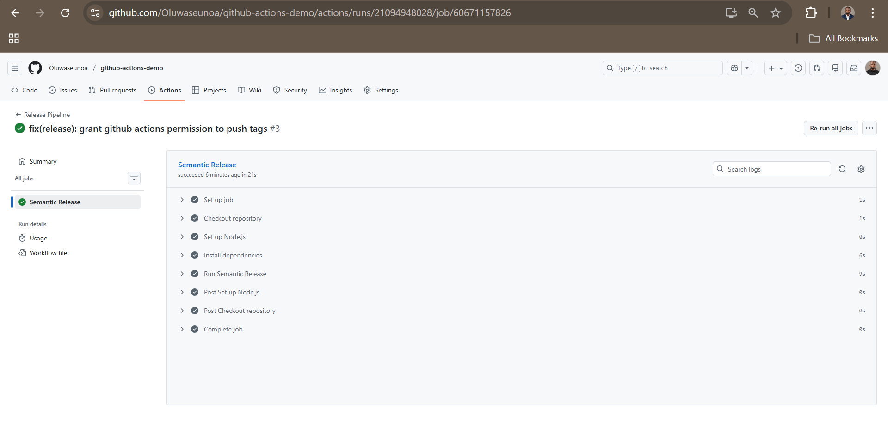

---

## Step 46: Verify Release Version on GitHub

On the repository dashboard, the new release version now displays:

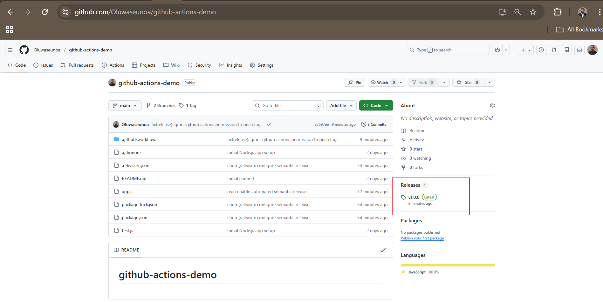

---

## Step 47: View Release Details

Clicking on the release version shows the release notes and details of the fixes included:

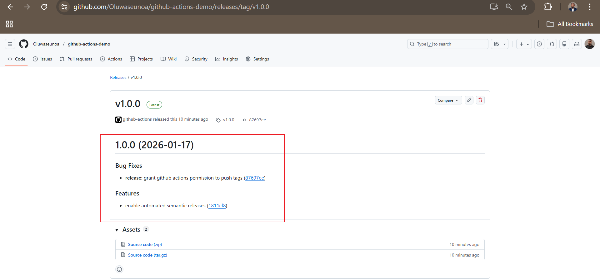

---

## Step 48: Receive Email Notification

If configured, receive an email notification about the new bug fixes and release:

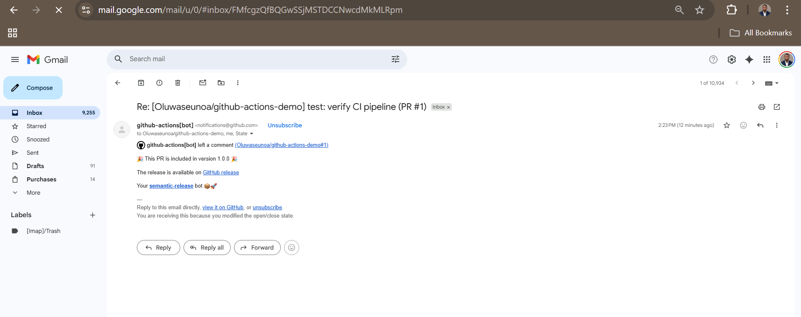

---

## Step 49: Log into AWS Console

Log into the AWS Management Console and navigate to **IAM** to manage users and permissions:

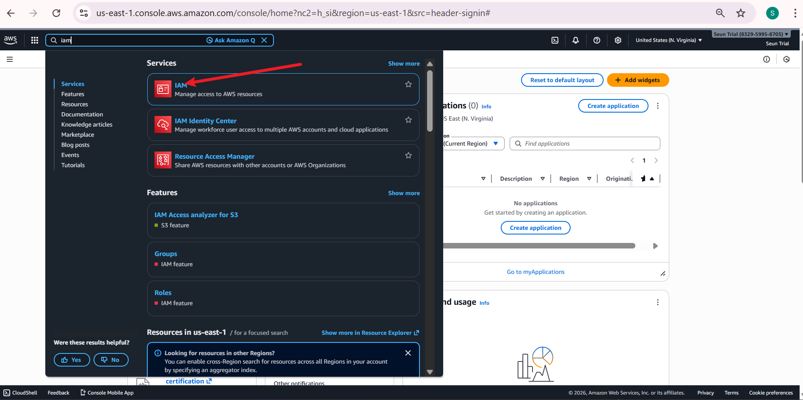

---

## Step 50: Access Users in IAM

Click on **Users** in the IAM dashboard to see the list of IAM users:

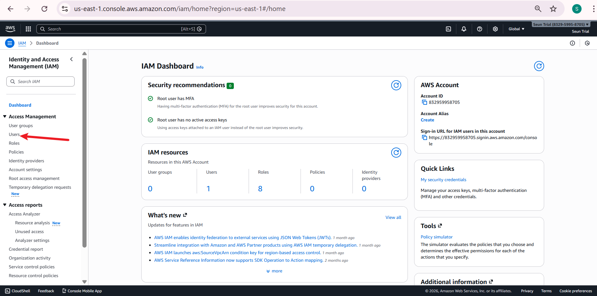

---

## Step 51: Verify or Create Active Access Key

Ensure the IAM user has an **active access key**. If not, create one. Note the displayed key for use in GitHub Secrets:


---

## Step 52: Copy AWS Credentials

On your local machine, view your AWS credentials and copy the **Access Key ID** and **Secret Access Key**:

```bash
cat ~/.aws/credentials
```


---

## Step 53: Open GitHub Secrets

Go to your repository on GitHub, click **Settings → Secrets and variables → Actions**:


---

## Step 54: Add New Repository Secret

Click **New repository secret** to add AWS credentials:


---

## Step 55: Add `AWS_ACCESS_KEY_ID`

Paste `AWS_ACCESS_KEY_ID` as the **name** and the Access Key ID as the **secret value**, then click **Add secret**:


---

## Step 56: Add `AWS_SECRET_ACCESS_KEY`

Similarly, add `AWS_SECRET_ACCESS_KEY` with its value and save as a secret:


---

## Step 57: Add `AWS_REGION`

Finally, add `AWS_REGION` as a secret with the appropriate AWS region value (e.g., `us-east-1`):


---

## Step 58: Open Elastic Beanstalk Console

In the AWS Console, search for **Elastic Beanstalk** and click on it to start deploying your application:


---

## Step 59: Create a New Application

Click **Create Application** to begin setting up a new Elastic Beanstalk application:


---

## Step 60: Select Web Server Environment

Select **Web Server Environment**, enter your **application name**, and scroll down to configure the environment:


---

Great! Let’s continue the README with **steps 61–70**, keeping the same clear and professional style.

---

## Step 61: Select Node.js Platform and Upload Code

Choose the **Node.js platform version 20**, select **Upload code from S3**, and add a deployment label (e.g., `v1.0.0`):


---

## Step 62: Click Next

Click **Next** to proceed to the next configuration step:


---

## Step 63: Configure Service Access

In the **Configure service access** step, click **Create Service Role**:


---

## Step 64: Set Use Case to Elastic Beanstalk

Ensure the **use case** is set to **Elastic Beanstalk**, then click **Next**:


---

## Step 65: Create Service Role with Appropriate Permissions

Review the permissions and click **Next → Review → Create** to create the service role:


---

## Step 66: Switch Back to Elastic Beanstalk Creation

Once the role is created, switch back to the **Elastic Beanstalk application creation** tab:


---

## Step 67: Create EC2 Instance Profile Role

Select **aws-elasticbeanstalk-service-role** and click to **create an EC2 instance profile role**:


---
## Step 68: Ensure Elastic Beanstalk Compute is Selected

Ensure **Elastic Beanstalk compute** is selected, then click **Next**:


---
## Step 68b: Review EC2 Instance Profile Role

Ensure the appropriate permissions are selected, review, and click **Create Role**:


---

## Step 69: Assign Roles and Key Pair

Select the created **service role**, click **Refresh** if the role is missing, then select the **EC2 key pair**, and click **Next**:


---

## Step 70: Configure VPC and Subnets

Select the **default VPC** and its subnets, and enable **public IP**:


---

## Step 71: Add Project and Environment Tags

Add **Project** and **Environment** tags for your Elastic Beanstalk environment, then click **Next**:


---

## Step 72: Configure Root Volume and EC2 Settings

Leave the **root volume** at default, enable **only IMDSv1**, set CloudWatch monitoring interval to **5 minutes**, and select the **default EC2 security group**:


---

## Step 73: Set Instance Type and Scaling

Choose **Single instance**, **On-Demand**, architecture **x86_64**, instance type **t3.micro**, and click **Next**:


---

## Step 74: Configure Monitoring

Set **enhanced health monitoring**, CloudWatch metrics, and other monitoring options according to your requirements:


---

## Step 75: Enable Managed Platform Updates

Enable **managed platform updates**, select the weekly maintenance window, and choose **minor and patch updates**:


---

## Step 75b: Configure Rolling Updates and Deployment

Set rolling update policies and deployment preferences to control how instances are updated:


---

## Step 76: Configure Platform Software Options

Set platform-specific options such as **proxy server**, **X-Ray**, **S3 log storage**, and **instance log streaming**:


---

## Step 77: Click Next

After reviewing optional settings, click **Next** to proceed to the final step:


---

## Step 78: Review Configuration and Create Environment

Review all settings, verify that everything is correct, and click **Create**:


---

## Step 79: Environment Creation in Progress

The Elastic Beanstalk environment is being created:


---

## Step 80: Environment Successfully Launched

Once the environment launches successfully, copy the provided **Elastic Beanstalk domain** and open it in a new browser tab to verify deployment:


---

## Step 81: Welcome to Elastic Beanstalk Page

Visit your Elastic Beanstalk environment’s domain to verify the application is running successfully:


---

## Step 82: Add Deployment Workflow

Create a **deployment workflow** in `.github/workflows` for deploying the application to Elastic Beanstalk:


---

## Step 83: Configure `deploy.yml` File

Edit the `deploy.yml` workflow file with the steps to **checkout code, install dependencies, run tests, zip the application, configure AWS credentials, and deploy to Elastic Beanstalk**:


---

## Step 84: Commit and Push Deployment Workflow

After creating the deployment workflow file, **commit and push** it to your repository:


---

## Step 85: Edit `app.js` to Trigger Deployment Workflow

Make a small **change in `app.js`** to trigger the deployment workflow when pushed:


---

## Step 86: Commit and Push Changes

Commit and push the changes to the repository to trigger the deployment workflow:


---

## Step 87: Navigate to Repository Actions

Go to the **Actions tab** in your GitHub repository and click on the **Deploy to Elastic Beanstalk workflow**:


---

## Step 88: Workflow Has Not Run Yet

Since the workflow is newly configured, it will show **“This workflow has no runs yet”**:


---

## Step 89: Update `deploy.yml` with Write Permission

Edit the `deploy.yml` to ensure the workflow has **write permission to push deployment tags or trigger further actions**:


---

## Step 90: Push and Commit Changes

Push and commit the changes to GitHub to activate the workflow:


---

## Step 91: Navigate to Repository Releases

Go to your GitHub repository **Releases tab** to view existing releases:


---

## Step 92: New Release Appears

The newly created release is visible, showing the **version number and commit**:


---

## Step 93: Workflow Did Not Run

At this point, the deployment workflow did **not run automatically**, indicating a configuration mismatch:


---

## Step 94: Update `deploy.yml` for Release Pipeline

Edit the `deploy.yml` workflow to **match the release pipeline name** and ensure **unique version labels** for Elastic Beanstalk deployments:


---

## Step 95: Commit and Push Changes

Commit and push the updated workflow to GitHub:


---

## Step 96: Make a New Feature Commit

Create a **new feature commit** to trigger the deployment pipeline and push it to the repository:


---

## Step 97: Release Version v1.3.0

Create a new release on GitHub to version the application as **v1.3.0**:


---

## Step 98: Deploy to AWS Elastic Beanstalk Pipeline Runs Successfully

The **Deploy to EBS workflow** now runs successfully, deploying the latest application version:


---

## Step 99: Application Live on Elastic Beanstalk

Finally, visit the **Elastic Beanstalk URL** to confirm the application is **live and accessible**:


---


## CI/CD Workflow Summary

1. **CI pipeline**: Runs tests on every PR or push.
2. **Semantic release pipeline**: Automatically generates release notes and versions using conventional commits.
3. **Deploy to Elastic Beanstalk**: Triggered on release, builds zip, uploads to S3, deploys to EBS.

---

## References

* [GitHub Actions Documentation](https://docs.github.com/en/actions)
* [AWS Elastic Beanstalk Documentation](https://docs.aws.amazon.com/elasticbeanstalk/latest/dg/Welcome.html)
* [Semantic Release](https://semantic-release.gitbook.io/semantic-release/)
* [einaregilsson/beanstalk-deploy](https://github.com/einaregilsson/beanstalk-deploy)


